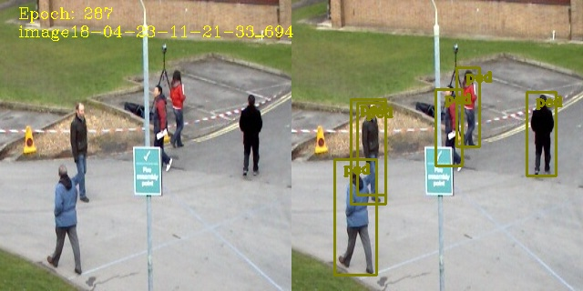

<a href="https://www.christoskyrkou.com/">

</a>

# Single Shot Object Detection in Tensorflow.Keras
UNDER CONSTUCTION 🚧 :construction_worker:

This repository implements a single shot object detection framework in Keras.

# Features
- [x] Training
- [x] Testing/Inference
- [x] Custom Networks
- [x] Custom Datasets
- [x] MAP Evaluation
- [ ] Restore Training (Not fully implemented.)

# Data Structure
You can use your own data by creating it within the following structure. Also you need to modify the *app_params.py* file with your data specifics as shown in the other examples.

```
./
└───data/
│   │
│   └───<dataset_name> (e.g. pets_2009)
│       │   └───train_im/(Image source files in .jpg format for training)
│   │   │    |    im (1).jpg
│   │   │    |    im (2).jpg
.
.
│   │   │    |    im (503).jpg
│       │   └───train_ann/ (Bounding Box Annotation Files for training)
│   │   │    |    im (1).xml
│   │   │    |    im (2).xml
.
.
│       │   └───val_im/(Image source files in .jpg format for validation)
│   │   │    |    im (504).jpg
│   │   │    |    im (505).jpg
.
.
│   │   │    |    im (600).jpg
│       │   └───val_ann/ (Bounding Box Annotation Files for validation)
│   │   │    |    im (504).xml
│   │   │    |    im (505).xml
```

# Dependencies

| Name | Version (min) |
| ------------- | ------------- |
| Python | 3.7  |
| Tensorflow | 2.0.0 |
| Numpy | 1.18.5  |
| Matplotlib | 3.3.4  |
| opencv-python | 4.5.1  |
| imagaug | 0.4.0  |

# How to run

You run a training example as follows:
```python
python det_keraspipeline.py -m resnet -d pets_2009 -s cosine -o adam -e 200 -lr 0.001
```

| Argument Name | Description |
| ------------- | ------------- |
| -m, -model | Select backbone model from: [vgg,resnet,mobileV2,mobile,yolopeds,dronet,tinyyolov2] |
| -d,-dataset | Select dataset to use from: [kangaroo,ennfudan,pets_2009,raccoon,air_cars] |
| -e,-epochs | Number of epochs for training |
| -l,-lr | Initial learning rate |
| -o,-optimizer | Select optimizer from [adam,sgd]  |
| -s,-scheduler | Select scheduler from [none, cosine, fix (reduce by 10 every 100 epochs)] |
| -w,-weights | Apply weights for imbalanced classes |

- The training will output, live detection results for a random image per epoch, mAP and loss curves as shown below. All this are stored in the <det_output> folder:




- Models (both the complete architecture and weights file) are saved in the <saved_models> folder. In addition, everry 100 epochs a checkpoint is saved.


# Backbone Models

The repository implements models of the following form:


Any of the backbone models can be selected. In addition, the detection layer can be configured according to the application needs.
- VGG16 (keras imagenet pretrained)
- Resnet50 (keras imagenet pretrained)
- MobileNetV2 (keras imagenet pretrained)
- MobileNetV1 (keras imagenet pretrained)
- YOLOpeds (custom)
- Dronet (custom)
- Tinyyolov2 (custom without imagenet weights)
- Any custom model that you want to create


## Citation Information
This repository implements improved models from the following papers:

- Christos Kyrkou, “YOLOPeds: Efficient Single-Shot Pedestrian Detection for Smart Camera Applications”, IET Computer Vision, 2020, 14, (7), p. 417-425, DOI: 10.1049/iet-cvi.2019.0897 [paper📜 ](https://digital-library.theiet.org/content/journals/10.1049/iet-cvi.2019.0897)

- Christos Kyrkou, George Plastiras, Stylianos Venieris, Theocharis Theocharides, Christos-Savvas Bouganis, "DroNet: Efficient convolutional neural network detector for real-time UAV applications," 2018 Design, Automation & Test in Europe Conference & Exhibition (DATE), Dresden, Germany, pp. 967-972, March 2018.  [paper📜 ](https://ieeexplore.ieee.org/document/8342149/),  [official DroNet repo 💻 ](https://github.com/gplast/DroNet)
